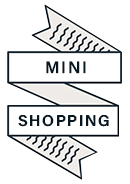
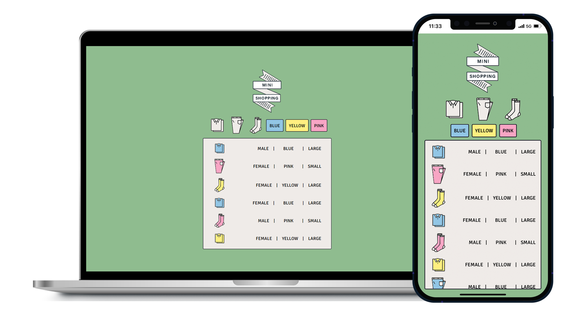
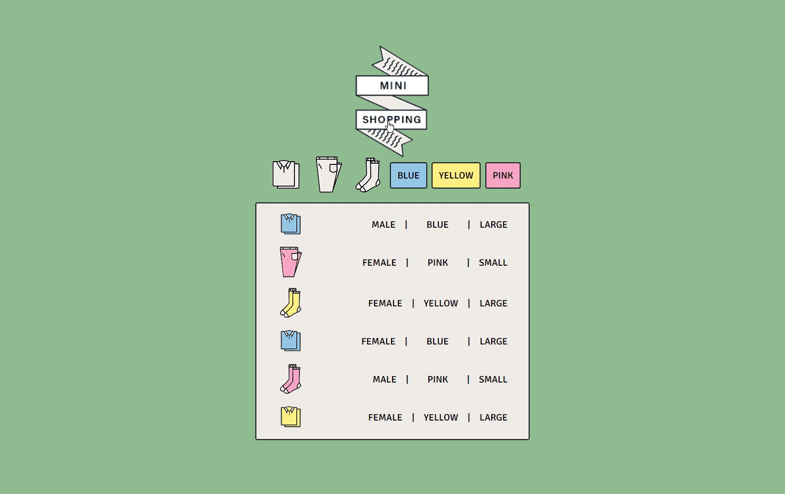

<div align="center"></div>
<div align="center"><h1>MINI-SHOPPING 🛍</h1></div>

<div align="center">[Link] : https://geena-keem.github.io/mini-shopping/</div> 




**[Features]**

```
- 버튼 마우스 오버 시 애니메이션 처리
- 데이터가 많아지면 스크롤링 바가 생긴다 (CSS에서 scrollbar hidden 처리)
- 버튼을 누르면 옷의 종류와 색상별로 필터링
```

**[Project structure]**

```
.
├─ README.md
├─ index.html
├─ style.css
└─ src
   └─ main.js
└─ imgs
   ├─ logo.png
   └─ ...
└─ data
   └─ data.json
```

**[Technology]**

```
- HTML5
- CSS3
- JavaScript
```

**[Reference]**

```
유튜브 채널 드림코딩 (미니 쇼핑몰 프로젝트)
```
